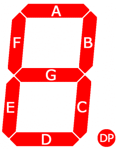
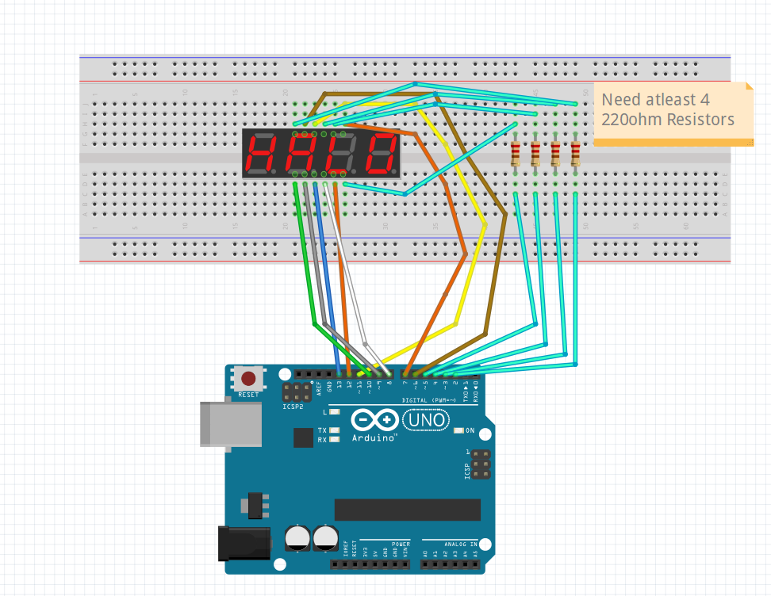
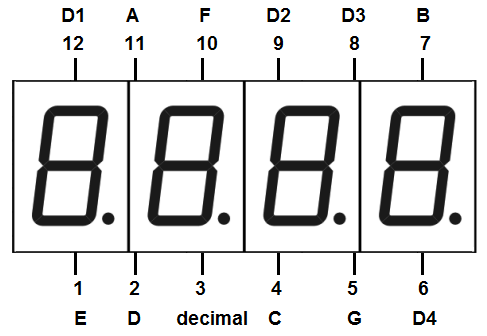

# 5641AS Red 4-Digit LED 7-Segment Display

## Projects

* Coming Soon...

## Component Specs and Setup

    

Seven Segment displays consist of 7 LED segments(shown above) along with the extra LED decimal point DP. Providing power to these segments will cause them to light up. Layout of connection pins shown below

You will need to ensure there is atleast 800Ω of resistance with the pins to ensure there is not a current overload(fritzing example show this setup) or if you do not have fritzing check out the image below

    

    

[Arduino Connection](./FritzingParts/5641AS_Arduino_Connection.fzz)

## Datasheet
http://www.xlitx.com/datasheet/5641AS.pdf

Creator: [Damon Rocha](http://github.com/dmarcr1997)