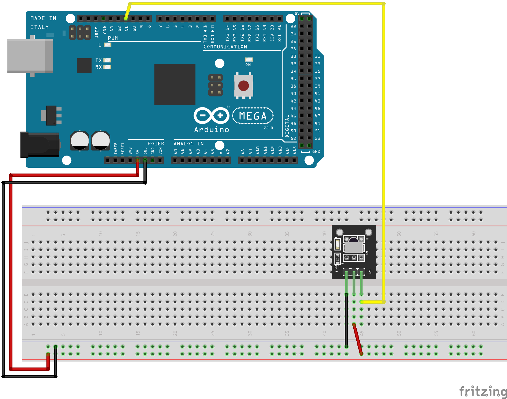

# IR Receiver (KY-022)

Small circuit board with 3 pins.  Receives Infrared codes from the include IR Remote control (shipped with no battery).

### Documentation
Project (with debounce code) https://docs.arduino.cc/built-in-examples/digital/Debounce

```
#include <IRremote.hpp>

int RECV_PIN = 11;

void setup() {
  IrReceiver.begin(RECV_PIN, ENABLE_LED_FEEDBACK);
}

void loop() {
  if (IrReceiver.decode()) {
    IrReceiver.printIRResultShort(&Serial);
    IrReceiver.resume();  // Receive the next value
  }
}
```

### Wiring
| Arduino | KY-022 |
| --- | -- |
| 11 | S |
| 5v | (center) |
| GND | - |



### Installation
Library https://github.com/Arduino-IRremote/Arduino-IRremote  
IRremote by shirriff, z3t0, ArminJo  

