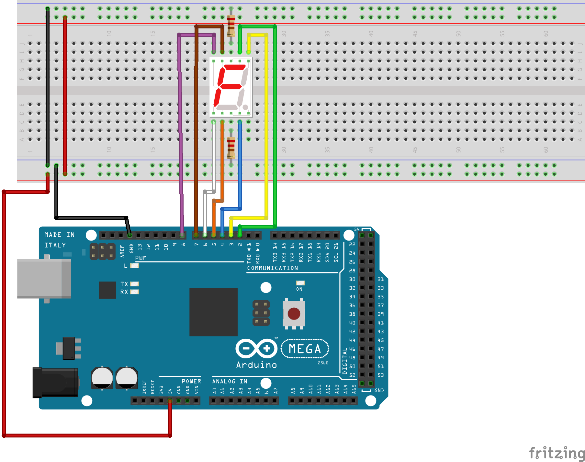

# 1 Digit 7 Segment LED (5161AS)

This part is a single digit, 7 segment LED Display.  Each segment on the device is lit when the corresponding pin
on the board is set to High, and digits can be formed by lighting the correct segments.

### Documentation
[Datasheet](http://www.xlitx.com/datasheet/5161AS.pdf)


```
constexpr uint8_t segmentA = 2  // attach Arduino pin 2 to segmentA (pin 7).
...

void setup() {
  pinMode(segmentA, OUTPUT); // Sets the segemntA pin as an OUTPUT
  ...
}

void loop() {
  digitalWrite(segmentA, HIGH);
}
```

### Wiring
| Arduino | 5161AS |
| --- | -- |
| 2 | 7 (A) |
| 3 | 6 (B) |
| 4 | 4 (C) |
| 5 | 2 (D) |
| 6 | 1 (E) |
| 7 | 9 (F) |
| 8 | 10 (G) |



### Installation
No libraries required for use.
