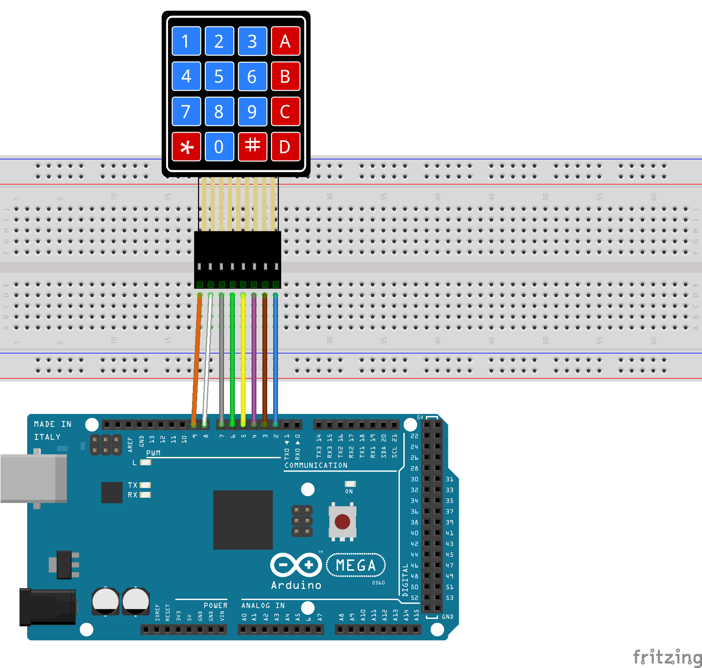

# 4x4 Membrand Switch Matrix Keypad

Membrane keypads are an excellent starting point for adding key input to a project because they are inexpensive, long-lasting, and resistant to water. And knowing how to interface them with an Arduino is extremely useful for building a variety of projects that require user input for menu selection, password entry, or robot operation.

### Documentation
* [Datasheet](https://www.jameco.com/Jameco/Products/ProdDS/2333119.pdf)
* [Sample Project](https://lastminuteengineers.com/arduino-keypad-tutorial/)

### Sample Program
```
#include <Keypad.h>

const byte ROWS = 4; //four rows
const byte COLS = 4; //three columns

char keys[ROWS][COLS] = {
  {'1','2','3', 'A'},
  {'4','5','6', 'B'},
  {'7','8','9', 'C'},
  {'*','0','#', 'D'}
};
byte rowPins[ROWS] = {9, 8, 7, 6}; //connect to the row pinouts of the keypad
byte colPins[COLS] = {5, 4, 3, 2}; //connect to the column pinouts of the keypad

//Create an object of keypad
Keypad keypad = Keypad( makeKeymap(keys), rowPins, colPins, ROWS, COLS );

void setup(){
  Serial.begin(115200);
}
  
void loop(){
  char key = keypad.getKey();// Read the key
  
  // Print if key pressed
  if (key){
    Serial.print("Key Pressed : ");
    Serial.println(key);
  }
}
```

### Wiring
| Arduino | Keypad |
| --- | -- |
| 2 | 8 |
| 3 | 7 |
| 4 | 6 |
| 5 | 5 |
| 6 | 4 |
| 7 | 3 |
| 8 | 2 |
| 9 | 1 |



### Installation
Install Keypad by Mark Sstanley, Alexander Brevig
