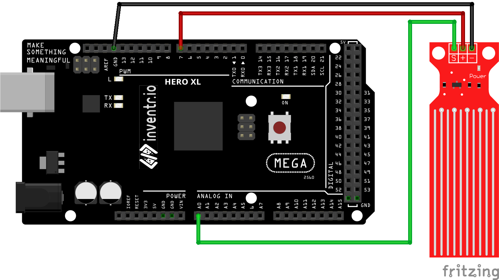

# Water Level Detector

picture

This sensor can measure water level.  It has ten exposed copper traces, five of which are power traces
and the remaining five are sense traces. These traces are interlaced so that there is one sense trace
between every two power traces.

Normally, power and sense traces are not connected, but when immersed in water, they are bridged, and
the rough water level can be measured on an analog input pin.

### Documentation
[Sample project/tutorial](https://lastminuteengineers.com/water-level-sensor-arduino-tutorial/)

Since the detector will degrade over time when powered up, we use a digital pin to power the detector only
when a reading is to be taken.
```
  constexpr byte ANALOG_PIN = A0;
  constexpr byte POWER_PIN = 7;

  pinMode(WATER_DETECTOR_PIN, INPUT);
  pinMode(POWER_PIN, OUTPUT);
  digitalWrite(POWER_PIN, LOW);

  digitalWrite(POWER_PIN, HIGH);
  delay(10);
  int waterLevel = analogRead(WATER_DETECTOR_PIN);
  digitalWrite(POWER_PIN, LOW);
```

### Wiring
| Arduino | Potentiometer |
| --- | --- |
| A0 | S |
| 7 | + |
| GND | - |



### Installation
No libraries or includes required.
