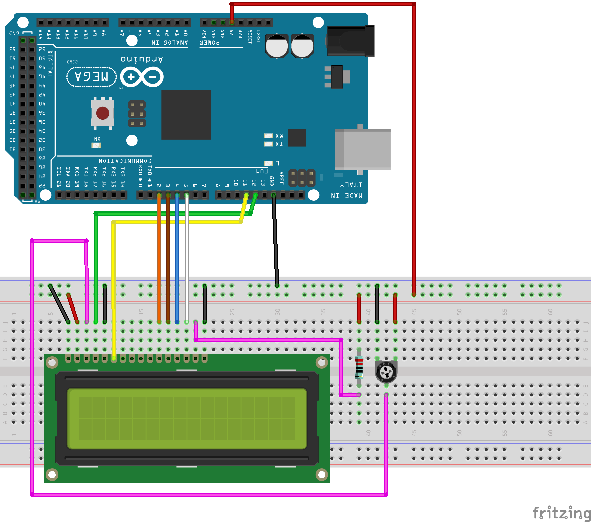

# LCD1602 16x2 LCD Display

A two line LCD display with 16 characters per line

### Documentation
* [Datasheet](https://www.waveshare.com/datasheet/LCD_en_PDF/LCD1602.pdf)
* [Hello World Example](https://docs.arduino.cc/learn/electronics/lcd-displays)

### Sample Program
```
#include <LiquidCrystal.h>
// LiquidCrystal lcd(6, 7, 8, 9, 10, 11); // RS, EN, D4, D5, D6, D7
LiquidCrystal lcd(12, 11, 2, 3, 4, 5); // RS, EN, D4, D5, D6, D7

void setup() {
  lcd.begin(16, 2); // lcd starts with resolution 16x2
}
void loop() {
  lcd.setCursor(0, 0);
  lcd.print("0123456789ABCDEF");
  lcd.setCursor(0, 1);
  lcd.print("0123456789ABCDEF");
  delay(2000);
  for (int row = 0; row < 2; row++) {
    for (int col = 0; col < 16; col++) {
      lcd.setCursor(col, row);
      lcd.print("0");
      delay(100);
      lcd.clear();
    }
  }
}
```

### Wiring (simplified with no potentiometer or resistor)
| Arduino | LCD1602 |
| --- | -- |
| GND | VSS |
| GND | RW |
| GND | K |
| 5v | VDD |
| 12 | RS |
| 11 | E |
| 2 | D4 |
| 3 | D5 |
| 4 | D6 |
| 5 | D7 |
| 3.3v | A |



### Installation
LiquidCrystal Library is available by default in Arduino IDE
