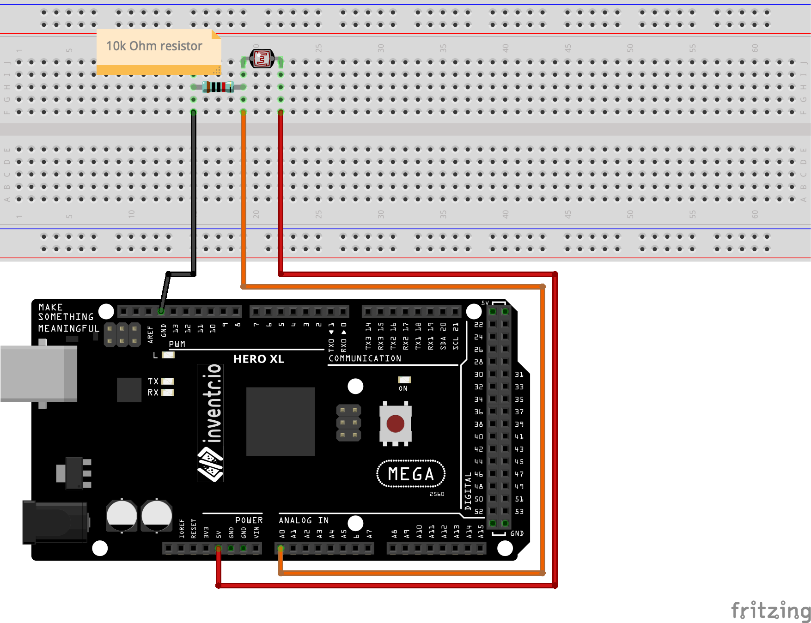

# Photo Resistor

A photo resistor, also known as a light-dependent resistor (LDR), is a type of resistor whose resistance varies based on the amount of light it is exposed to. Photo resistors are typically made from a semiconductor material, such as cadmium sulfide, that changes its electrical conductivity when exposed to light. They are often used in light-sensitive applications, such as street lights and camera flash units, to control the amount of electrical current flowing through a circuit.

# Coding
A photo resistor can be used with an Arduino Mega by connecting it to one of the analog input pins on the board.
Here are the general steps for using a photo resistor with an Arduino Mega:

* Connect one end of the photo resistor to one of the analog input pins (e.g. A0, A1, etc.) on the Arduino Mega.
* Connect the *same* end of the photo resistor to a pull-down resistor (e.g. 10k Ohm) and then to ground.
* Connect the other end of the photo resistor to the 5v power source.
* In the Arduino IDE, use the analogRead() function to read the voltage on the analog input pin to which the photo resistor is connected.

You can use a map function to convert the analog read value to a meaningful range or use it as is.
Use the reading to control any other device connected to the arduino.
It's important to note that you may need to adjust the value of the pull-down resistor based on the specifications of the photo resistor you are using.
# Code
```
int sensorPin  = A0;  // select an Analog input pin for reading the photo resistor value

void setup() {
  pinMode(onboardLED, OUTPUT);
}

void loop() {
  // Read and save the analog sensor value
  int sensorValue = analogRead(sensorPin);
  // ...
}
```

### Wiring
| Arduino | LED |
| --- | --- |
| A0 | first lead of photo resistor |
| GND | 10K ohm resistor then A0 lead (above) |
| 5v | other lead of photo resistor |



### Installation
No libraries or includes required.
