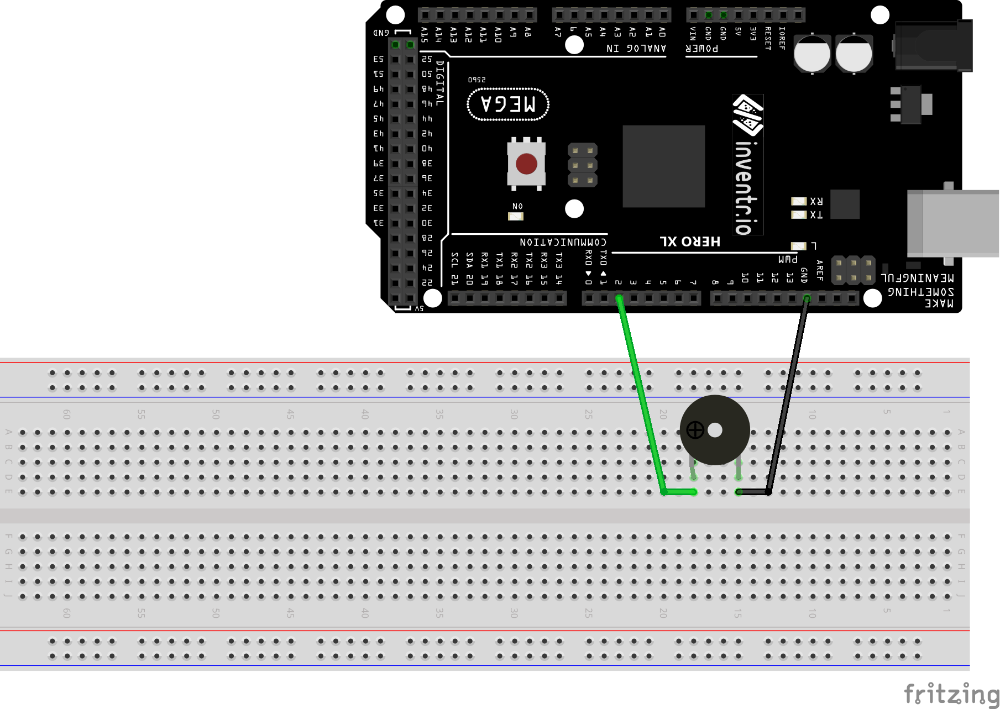

# Active Buzzers

## Two Pin Active Buzzer

Fixed pitch buzzer that buzzes when ever + PIN is held HIGH.  Can be found in misc small parts box.  There are TWO small buzzers in the kit, one active and one passive.  The active buzzer that I have has a 'sealed' back:


```
  digitalWrite(BUZZER_PIN, HIGH); // Turn on buzzer
  delay(1000);                    // let it run one second
  digitalWrite(BUZZER_PIN, LOW);  // Turn off buzzer
```

### Wiring
| Arduino | Buzzer |
| --- | --- |
| 2 | + |
| GND | other |



### Installation
No libraries or includes required.

## Three Pin Active Buzzer (KY-012, none found in kit)

Fixed pitch buzzer that buzzes when ever + PIN is held HIGH.
```
  digitalWrite(BUZZER_PIN, HIGH); // Turn on buzzer
  delay(1000);                    // let it run one second
  digitalWrite(BUZZER_PIN, LOW);  // Turn off buzzer
```
## Wiring
| Arduino | Buzzer |
| --- | --- |
| 2 | S |
| GND | - |


## Installation
No libraries or includes required.
