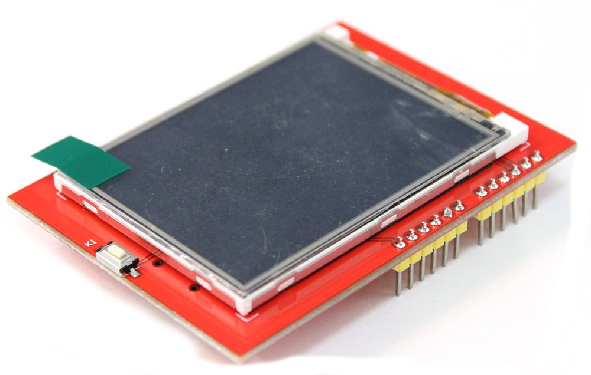

# Arduino shield with TFT LCD display and touch panel (ILI9341)



This 2.4" 240x320 LCD display by HiLetgo has pins that allows it to be directly installed onto an Arduino Uno or Mege (a "shield").  Thus, there's no wiring diagram.  Simply fit the shield onto the Arduino so that the 3.3v and 5v pins match the same pins on the Arduino.

This shield almost operates like two distinct parts; an LCD display underneath a touch panel.  Different libraries are used to interface with each, and the LCD display is placed into a different rotation the LCD coordinates need to be handled separately.

## Getting Started

Since this is a complex device we have multiple Arduino programs to get you up and running with this shield.

### Step 1: Initial LCD test and orientation

The LCD display can be rotated so that any of it's four sides are designated as "top".  Rotations are numbered 0-4 with rotation 0 used when the display is oriented with the white reset button on top.  The remaining rotations proceed in a clockwise direction (as will be demonstrated with our first test program).

Rotations:

0. Portrait rotation (white button on top)
1. Landscape rotation (white button on left)
2. Portrait rotation (white button on bottom)
3. Landscape rotation (white button on right)

Test Program:

Load 1-ShowLCDRotations and upload.  You should see each text displayed in each rotation briefly.  For each, the origin (x=0, y=0) is displayed in the proper corner and the rotation number is displayed in the center of the display.

### Step 2: Touch Panel Calibration

Since the touch panel is an analog device it also needs to be calibrated so that touch panel coordinates can be accurately mapped to the LCD panel coordinates.

Test Program:

Load 2-TouchScreenCalibration and upload.  You will be instructed to press the stylus down to begin the test.  You will then be presented with a number of small red boxes containing plus signs ('+').  As each box turns white press the stylus onto the center of the '+' sign and hold it until the box turns red.

Once each box has been pressed you will be presented with calibration numbers on-screen and in the serial console.  You will need these numbers for use in programs using this device so please copy and save them from the Serial console.

They will look something like this:

```
constexpr int XP=8,XM=A2,YP=A3,YM=9; //240x320 ID=0x9341
constexpr int TS_LEFT=109,TS_RT=914,TS_TOP=86,TS_BOT=905;

PORTRAIT  CALIBRATION     240 x 320
x = map(p.x, LEFT=109, RT=914, 0, 240)
y = map(p.y, TOP=86, BOT=905, 0, 320)

LANDSCAPE CALIBRATION     320 x 240
x = map(p.y, LEFT=86, RT=905, 0, 320)
y = map(p.x, TOP=914, BOT=109, 0, 240)
```

### Step 3: LCD graphics with touch controls and rotation

Once you have the touch panel calibrated you can use those numbers to coordinate the on-screen graphics with touch events.

Test Program:

Load 3-TouchSwitchWithRotation.  Locate the comments with "======" and replace the lines between those comments with the "constexpr" lines you saved in Step 2.  Upload and try out the demo, clicking each button to switch the light.  Also, click *outside* the buttons to verify that only button clicks are detected.

If the clicks don't align well with the buttons then re-run the Calibration program and enter the updated calibration values and try again.

### Step 4: Graphics Demo!

Load 4-GraphicsDemo and upload to see a demo of the graphics capabilities of this shield.

## Installation
Install MCUFRIEND_kbv and Adafruit TouchScreen from Arduino IDE Library Manager.

