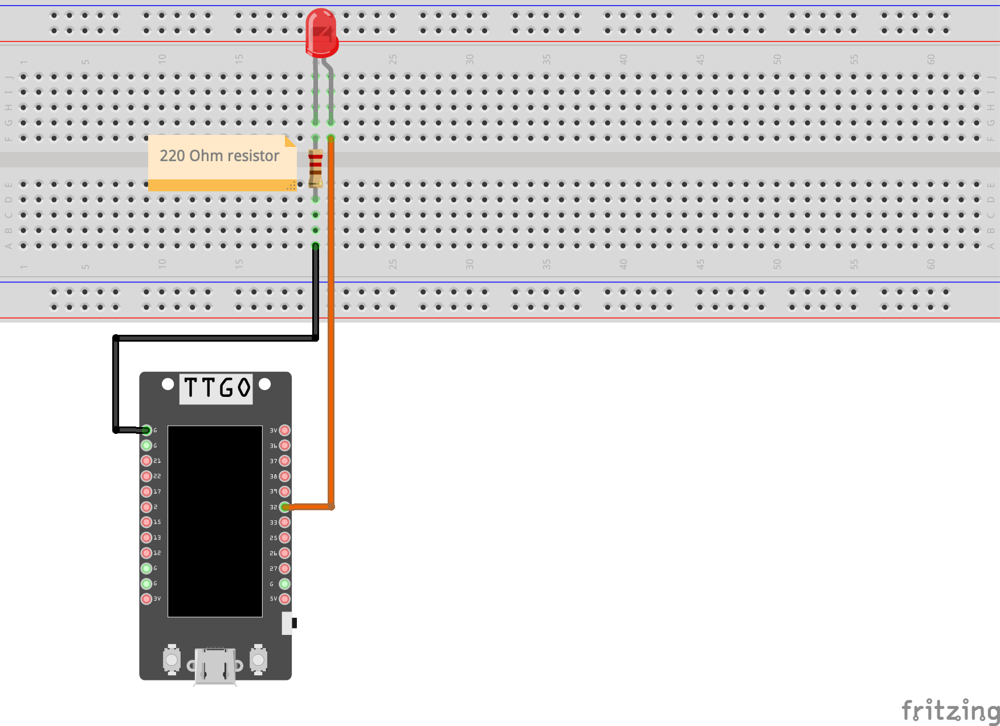

# Light Emitting Diode (LED)

A light-emitting diode (LED) is a semiconductor device that emits light when an electric current is passed through it. LEDs are small, efficient, and long-lasting, making them ideal for a wide range of applications such as indicator lights, digital displays, and lighting. They are available in a variety of colors and sizes.

# Coding
An LED can be easily controlled in a T-Display circuit by connecting it to a digital output pin and using the digitalWrite() function to turn it on or off. Here is an example of how an LED can be connected and controlled using the T-Display:

Connect the positive leg of the LED (the longer one) to a digital output pin on the T-display board.
Connect the negative leg of the LED (the shorter one) to a resistor.
Connect the other end of the resistor to the GND pin on the T-Display board.
In the Arduino code, use the pinMode() function to set the digital output pin as an output.
Use the digitalWrite() function to turn the LED on or off by sending a HIGH or LOW signal to the digital output pin.
For example, the following code will turn on the LED connected to digital pin 13:

```
pinMode(32, OUTPUT);  // set digital pin 13 as an output
digitalWrite(32, HIGH); // turn on the LED

// And this will turn it off
digitalWrite(32, LOW); // turn off the LED
```

It's important to note that the value of the resistor is important to avoid overloading the LED and burn it. Usually a value around 220 ohms is a good starting point for a standard LED.

### Wiring (Number Potentiometer pins starting with single pin (1) and proceeding clockwise)
| Arduino | LED |
| --- | --- |
| GND | 220 ohm resistor then the negative (shorter) lead |
| 32 | Positive (longer) LED lead |



### Installation
No libraries or includes required.
