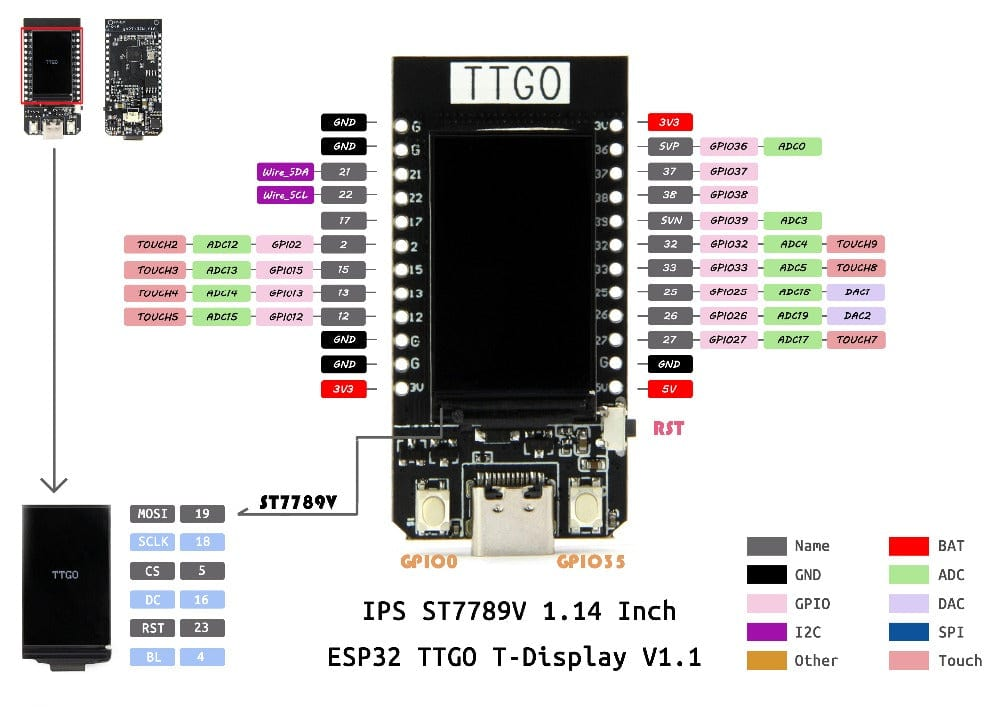

# LilyGo ESP32 TTGO T-Display
The LilyGo TTGO T-Display ESP32 is a small development board designed for Internet of Things (IoT) projects. It features an ESP32 microcontroller, which is a powerful and versatile chip that can be programmed using the Arduino IDE or other ESP32 IDEs.  It can also run MicroPython language using IoT MicroPython IDEs.

The board is called "T-Display" because it has a built-in 1.14-inch color display that can be used to show sensor data, graphics, or other information. The display has a resolution of 135x240 pixels and is based on the ST7789V chip.

In addition to the display, the board has several other useful features, including a USB-C port for power and programming, a battery connector for portable use and two user programmable buttons.

The TTGO T-Display ESP32 also has support for Wi-Fi and Bluetooth connectivity, which makes it easy to connect to the internet and communicate with other devices. It has an onboard antenna for Wi-Fi and supports both BLE (Bluetooth Low Energy) and classic Bluetooth.

Overall, the LilyGo TTGO T-Display ESP32 is a powerful and versatile development board that is well-suited for a wide range of IoT projects, especially those that require a compact form factor and a built-in display.

## Specifications
* Chipset ESPRESSIF-ESP32 240MHz Xtensa® single-/dual-core 32-bit LX6 microprocessor
* FLASH QSPI flash 4MB
* SRAM 520 kB SRAM
* Button Reset
* USB to TTL Silicon Labs CP2104
* Modular interface UART, SPI, SDIO, I2C, LED PWM, TV PWM, I2S, IRGPIO, ADC, Capacitive Touch Sensor, DACLNA Pre-Amplifier
* Display IPS ST7789V 1.14 Inch
* Working voltage 2.7V-4.2V
* Working current About 67MA
* Sleep current About 350uA
* Working temperature range -40℃ ~ +85℃
* Size & Weight 51.49mmx25.09mm (7.81g)
* Power Supply Specifications
* Power Supply USB 5V/1A
* Charging current 500mA
* Battery 3.7V lithium battery
* JST Connector 2Pin 1.25mm
* USB Type-C

### Wi-Fi
* Standard FCC/CE-RED/IC/TELEC/KCC/SRRC/NCC (ESP32 chip)
* Protocol 802.11 b/g/n (802.11n, speed up to150Mbps) A-MPDU and A-MSDU polymerization, support 0.4μS Protection interval
* Frequency range 2.4GHz~2.5GHz(2400M~2483.5M)
* Transmit Power 22dBm
* Communication distance approximately 300m

### Bluetooth
* Protocol Meet bluetooth v4.2BR/EDR and BLE standard
* Radio frequency With -97dBm sensitivity NZIF receiver Class-1, Class-2 & Class-3 emitter AFH Audio frequency CVSD&SBC audio frequency

### Software Specifications
* Wi-Fi Mode Station/SoftAP/SoftAP+Station/P2P
* Security mechanism WPA/WPA2/WPA2-Enterprise/WPS
* Encryption Type AES/RSA/ECC/SHA
* Firmware upgrade UART download/OTA (Through network/host to download and write firmware)
* Software Development Support cloud server development /SDK for user firmware development
* Networking protocol IPv4, IPv6, SSL, TCP/UDP/HTTP/FTP/MQTT
* User Configuration AT + Instruction set, cloud server, android/iOSapp
* OS FreeRTOS

[TTGO T-Display GitHub](https://github.com/Xinyuan-LilyGO/TTGO-T-Display)
[Schematic Diagram](https://github.com/Xinyuan-LilyGO/TTGO-T-Display/blob/master/schematic/ESP32-TFT(6-26).pdf)

## Arduino IDE installation to support ESP32 TTGO T-Display
Here are the step-by-step instructions for installing the Arduino IDE and configuring it to support the ESP32 TTGO T-Display:

1. Download the Arduino IDE from the official website: https://www.arduino.cc/en/software
2. Install the Arduino IDE on your computer.
3. Open the Arduino IDE and click on "File" in the menu bar.
4. Select "Preferences" from the dropdown menu.
5. In the "Additional Boards Manager URLs" field, add the following URL: https://raw.githubusercontent.com/espressif/arduino-esp32/gh-pages/package_esp32_index.json (Separate by commas or click blue button on right if you have multiple additional board manager URLs.)
6. Click "OK" to close the preferences window.
7. Go to "Tools" in the menu bar, and select "Board" from the dropdown menu.
8. Select "Boards Manager" from the submenu.
9. In the "Boards Manager" window, search for "ESP32".
10. Click on "esp32 by Espressif Systems" and click the "Install" button.
11. Wait for the installation to complete.
12. Close the "Boards Manager" window.
13. In the "Tools" menu, select "Board" again and select "ESP32 Dev Module" as the board.
14. Connect the ESP32 TTGO T-Display to your computer using a USB-C cable.
15. In the "Tools" menu, select "Port" and choose the correct port for your ESP32 TTGO T-Display.
16. You are now ready to develop for the ESP32 TTGO T-Display using the Arduino IDE.

Note: Some additional libraries may be required for developing with the ESP32 TTGO T-Display, depending on your specific project needs. You can find these libraries in the Arduino Library Manager, which can be accessed through the "Sketch" menu in the Arduino IDE.

## Inventory checks
* [002 Light Emitting Diode](002-LightEmittingDiode)
* [004 RGB Light Emitting Diode/](004-RGB-LightEmittingDiode)
* [006 Photo Resistor](006-PhotoResistor)
* [010 Active Buzzer](010-ActiveBuzzer)
* [020 Passive Buzzer](020-PassiveBuzzer)
* [030 Potentiometer](030-Potentiometer)
* [035 Rotary Encoder](035-RotaryEncoder)
* [040 Push Button](040-PushButton)
* [050 Water Level Detector](050-WaterLevelDetector)
* [060 IR Receiver](060-IrReceiver)
* [070 Ultrasonic Sensor](070-UltrasonicSensor)
* [080 1 Digit 7 Segment LED](080-1Digit7SegmentLED)
* [085 4 Digit 7 Segment LED](085-4Digit7SegmentLED)
* [090 PIR Motion Sensor](090-PIRMotionSensor)
* [100 4x4 Membrane Keypad](100-4x4_MembraneKeypad)
* [110 Game Joystick](110-GameJoystick)
* [120 Temperature and Humidity Sensor](120-TemperatureHumidity)
* [130 SoundSensor](130-SoundSensor)
* [140 Real Time Clock](140-RealTimeClock)
* [150 RFID Reader](150-RFID_Reader)
* [160 Accelerometer / Gyroscope](160-AccelerometerGyroscope)
* [170 Sweep Servo (180 degree)](170-180SweepServo)
* [200 16x2 LCD Display](200-LCD_Display)
* [240 240x320 TFT Touch Screen](240_TouchScreen)
