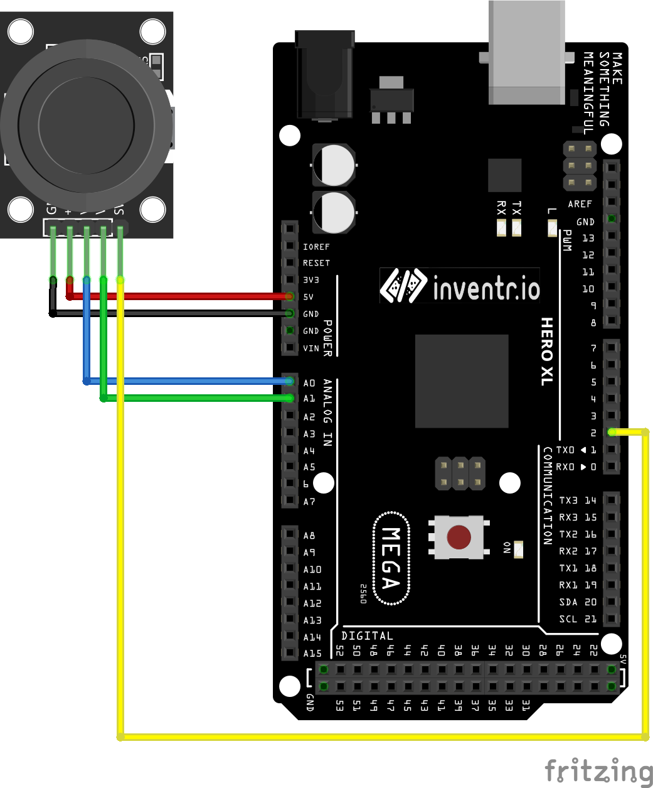

# Game Joystick (KY-023)

5V part that sends out The KY-023 Dual Axis Joystick module uses a uses a biaxial potentiometers
to control the X and Y axis. When pushed down, it activates a switch. Based on the PS2 controller's
joystick, it's used to control a wide range of projects from RC vehicles to color LEDs.

### Documentation
[Datasheet](https://arduinomodules.info/ky-023-joystick-dual-axis-module/)


```
const int SW_pin = 2; // digital pin connected to switch output
const int X_pin = A0; // analog pin connected to X output
const int Y_pin = A1; // analog pin connected to Y output
 
void setup() {
  pinMode(SW_pin, INPUT);
  digitalWrite(SW_pin, HIGH);
}

void loop() {
  Serial.print("Switch:  ");
  Serial.print(digitalRead(SW_pin));
  Serial.print("\n");
  Serial.print("X-axis: ");
  Serial.print(analogRead(X_pin));
  Serial.print("\n");
  Serial.print("Y-axis: ");
  Serial.println(analogRead(Y_pin));
  Serial.print("\n\n");
  delay(500);
}
```

### Wiring
| Arduino | HC-SR04 |
| --- | -- |
| 5v | 5v |
| GND | GND |
| A0 | VRx |
| A1 | VRy |
| 2 | SW |



### Installation
No libraries required for use.
