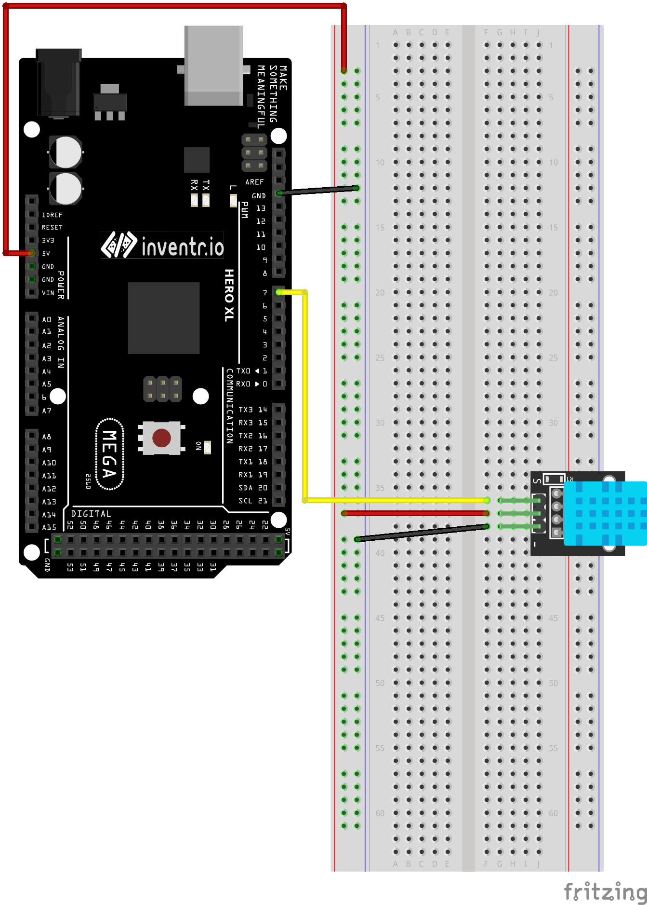

# Temperature and Humidity Sensor (KY-015 / DHT-11)

The KY-015 Temperature and Humidity Sensor module provides a digital serial interface to measure
environment humidity and temperature. Compatible with various microcontrollers like Arduino,
Raspberry Pi and ESP32.

Note that this part is very sensitive so anti-static precautions should be taken to avoid damaging the part.

### Documentation
[Project Page](https://arduinomodules.info/ky-015-temperature-humidity-sensor-module/)


```
#include "Arduino.h"
#include "DHT.h"

constexpr byte DHTPin = 7;	// Digital pin connected to DHT Sensor
#define DHTTYPE DHT11

DHT dht(DHTPIN, DHTTYPE);

void setup() {
  Serial.begin(9600);
  Serial.println(F("DHTxx test!"));

  dht.begin();
}

void loop() {
  // Wait a few seconds between measurements.
  delay(2000);

  // Reading temperature or humidity takes about 250 milliseconds!
  // Sensor readings may also be up to 2 seconds 'old' (its a very slow sensor)
  float h = dht.readHumidity();
  // Read temperature as Celsius (the default)
  float t = dht.readTemperature();
  // Read temperature as Fahrenheit (isFahrenheit = true)
  float f = dht.readTemperature(true);

  // Check if any reads failed and exit early (to try again).
  if (isnan(h) || isnan(t) || isnan(f)) {
    Serial.println(F("Failed to read from DHT sensor!"));
    return;
  }
}
```

### Wiring
| Arduino | HC-SR04 |
| --- | -- |
| 7 | S |
| 5v | 5v |
| GND | - |



### Installation

REQUIRES the following Arduino libraries:
 - DHT Sensor Library: https://github.com/adafruit/DHT-sensor-library
 - Adafruit Unified Sensor Lib: https://github.com/adafruit/Adafruit_Sensor
