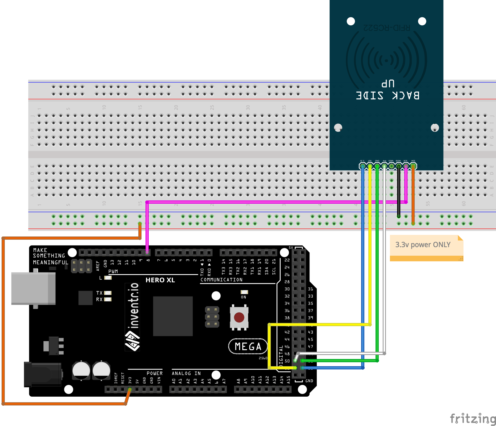

# RFID Reader (RFID-RC522)

RFID means radio-frequency identification. RFID uses electromagnetic fields to transfer data over short distances. RFID is useful to identify people, to make transactions, etc…

You can use an RFID system to open a door. For example, only the person with the right information on his card is allowed to enter.

### Documentation
[Project Page](https://www.instructables.com/Interfacing-RFID-RC522-With-Arduino-MEGA-a-Simple-/) - Note that code used here is not code from project and I used a different library but there's still some good information here.

[Another Project for Arduino UNO](https://randomnerdtutorials.com/security-access-using-mfrc522-rfid-reader-with-arduino/) Using the UNO with different pinouts, but this is an older version of the library I used (below).

### Wiring
| Arduino | RFID-RC522 |
| --- | -- |
| 8 | RST |
| 53 | SDA(SS) |
| 51 | MOSI |
| 50 | MISO |
| 52 | SCK |
| 3.3v | VCC |
| GND | GND |

### Installation
Installed MFRC522-spi-i2c-uart-async from Arduino IDE Library Manager